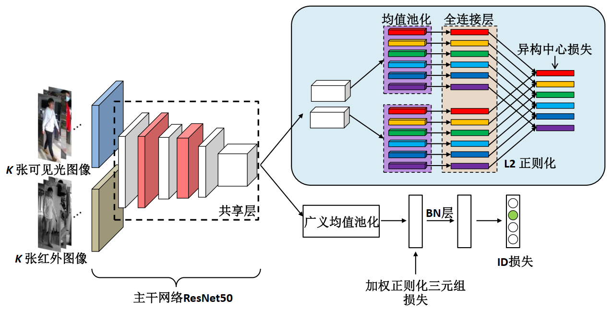
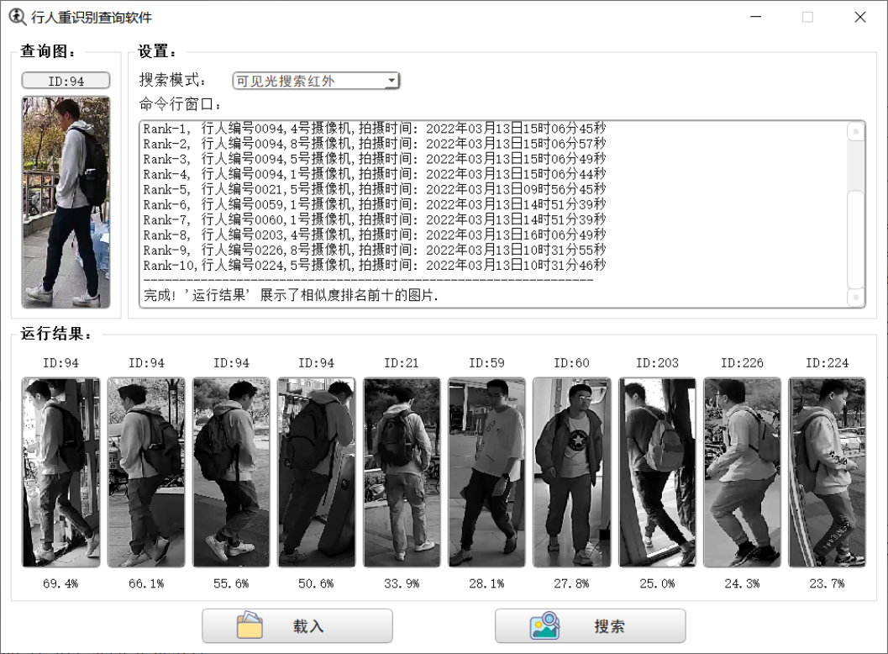

# 跨模态行人重识别网络改进

网络结构图：

软件界面：

## 目录说明

- `get_video`：用于读取并保存 8 路海康威视摄像头录像。
- `GUI`：软件界面。
- `visualization`：用于画图，算法效果的可视化结果。
- `log`：模型运行时的 tensorboard 日志。

## 文件说明

- 以 `_nwpu` 结尾文件和函数的使用 NWPU-ReID 自制数据集。

- 以`_sysu` 结尾文件的文件和函数使用 [SYSU-MM01](https://drive.google.com/open?id=181K9PQGnej0K5xNX9DRBDPAf3K9JosYk)开源数据集。

- `a_divide_dataset.py` 用于划分数据集。
- `b_pre_process_nwpu` 用于预处理数据集。

>Baseline：[mangye16/Cross-Modal-Re-ID-baseline](https://github.com/mangye16/Cross-Modal-Re-ID-baseline)
>
>Hetero-center-loss：[98zyx/Hetero-center-loss-for-cross-modality-person-re-id](https://github.com/98zyx/Hetero-center-loss-for-cross-modality-person-re-id)

## 权重下载

链接：https://pan.baidu.com/s/1Ufd-dyu2NaB4u3E2i7jqYA ，提取码：dy0y
